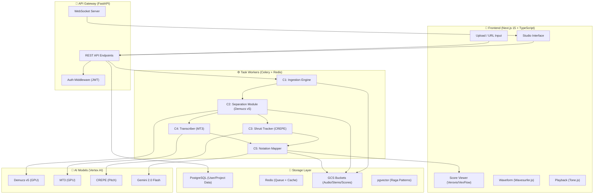
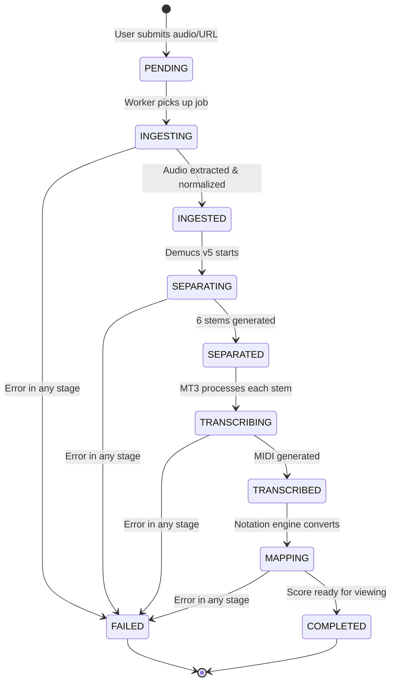
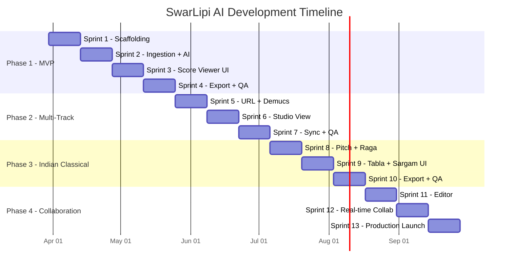

# SwarLipi AI — Implementation Plan

> **Project**: SwarLipi AI  
> **Document Version**: 1.0.0  
> **Date**: March 26, 2026  
> **Author**: Lead Architect Agent  
> **Architecture Style**: Microservices / Agentic Pipeline  

---

## Table of Contents
1. [Architecture Overview](#1-architecture-overview)
2. [Directory Structure](#2-directory-structure)
3. [Phase 1 — MVP Foundation](#3-phase-1--mvp-foundation)
4. [Phase 2 — Multi-Instrument & URL Support](#4-phase-2--multi-instrument--url-support)
5. [Phase 3 — Indian Classical Notation](#5-phase-3--indian-classical-notation)
6. [Phase 4 — Collaboration & Production](#6-phase-4--collaboration--production)
7. [API Contract](#7-api-contract)
8. [Risk Assessment](#8-risk-assessment)
9. [Key Technical Decisions](#9-key-technical-decisions)

---

## 1. Architecture Overview

### High-Level Pipeline: "Stream-to-Score"



### Processing Pipeline State Machine



---

## 2. Directory Structure

### Frontend (Next.js 15)
```
swarlipi-frontend/
├── app/
│   ├── layout.tsx                # Root layout (Cosmic Dark theme)
│   ├── page.tsx                  # Landing / Dashboard
│   ├── (auth)/
│   │   ├── login/page.tsx
│   │   └── signup/page.tsx
│   ├── projects/
│   │   ├── page.tsx              # Project list
│   │   └── [id]/
│   │       ├── page.tsx          # Multi-Track Studio View
│   │       ├── processing/page.tsx
│   │       └── editor/page.tsx   # Interactive editor (Phase 4)
│   └── api/                      # Next.js API routes (proxy)
├── components/
│   ├── ui/                       # Shared UI primitives
│   ├── upload/                   # Upload & URL input
│   ├── score/                    # Verovio + VexFlow wrappers
│   │   ├── StaffNotation.tsx
│   │   ├── SargamRenderer.tsx
│   │   └── TablaBolDisplay.tsx
│   ├── studio/                   # Multi-track studio
│   │   ├── TrackMixer.tsx
│   │   ├── WaveformTrack.tsx
│   │   └── PlaybackControls.tsx
│   └── editor/                   # Note editor (Phase 4)
├── lib/
│   ├── api.ts                    # API client (TanStack Query)
│   ├── auth.ts                   # Auth helpers
│   └── notation.ts               # Notation utilities
├── styles/
│   └── globals.css               # Tailwind + Cosmic Dark tokens
├── public/
├── next.config.ts
├── tailwind.config.ts
└── tsconfig.json
```

### Backend (FastAPI + Python)
```
swarlipi-backend/
├── app/
│   ├── main.py                   # FastAPI app entry point
│   ├── config.py                 # Environment config
│   ├── api/
│   │   ├── v1/
│   │   │   ├── routes/
│   │   │   │   ├── transcribe.py # POST /transcribe
│   │   │   │   ├── scores.py     # GET/PATCH /score/{id}
│   │   │   │   ├── projects.py   # GET /projects
│   │   │   │   └── raga.py       # GET /raga-lookup
│   │   │   └── deps.py           # Shared dependencies
│   │   └── websocket.py          # WebSocket handlers
│   ├── models/
│   │   ├── user.py
│   │   ├── project.py
│   │   └── stem.py
│   ├── schemas/
│   │   ├── project.py            # Pydantic schemas
│   │   ├── score.py
│   │   └── raga.py
│   ├── services/
│   │   ├── ingestion.py          # C1: yt-dlp + FFmpeg
│   │   ├── separation.py         # C2: Demucs wrapper
│   │   ├── shruti_tracker.py     # C3: CREPE + pitch contour
│   │   ├── transcription.py      # C4: MT3 wrapper
│   │   ├── notation_mapper.py    # C5: MIDI → MusicXML/Sargam
│   │   └── gemini_service.py     # Gemini 2.0 Flash integration
│   ├── tasks/
│   │   ├── celery_app.py         # Celery configuration
│   │   ├── ingestion_task.py
│   │   ├── separation_task.py
│   │   └── transcription_task.py
│   ├── db/
│   │   ├── session.py            # SQLAlchemy async engine
│   │   └── migrations/           # Alembic migrations
│   └── utils/
│       ├── storage.py            # GCS helpers
│       └── audio.py              # FFmpeg helpers
├── data/
│   └── raga_dictionary.json      # 200+ Raga definitions
├── tests/
├── Dockerfile
├── pyproject.toml
└── celery_worker.sh
```

---

## 3. Phase 1 — MVP Foundation
**Duration**: Weeks 1–8  
**Goal**: Single MP3 upload → Western Staff Notation

### Sprint 1 (Weeks 1–2): Project Scaffolding

> [!IMPORTANT]
> All foundational infrastructure must be rock-solid before AI integration begins.

#### Week 1: Backend Foundation
| Day | Tasks | Deliverable |
|-----|-------|-------------|
| 1–2 | Initialize FastAPI project, folder structure, config management (Pydantic Settings) | Working `uvicorn` server with health endpoint |
| 2–3 | Set up PostgreSQL + Alembic; create `User`, `Project`, `Stem` models | DB migrations pass, tables created |
| 3–4 | Set up Redis, configure Celery with Redis broker | Celery worker connects and processes test task |
| 5 | Configure GCS client library, create bucket helper utilities | Upload/download test passes to GCS |

#### Week 2: Frontend Foundation + Auth
| Day | Tasks | Deliverable |
|-----|-------|-------------|
| 1–2 | Initialize Next.js 15 with TypeScript; configure Tailwind CSS 4.0 | App renders with Cosmic Dark theme |
| 2–3 | Design Cosmic Dark design system: color palette, typography (Google Fonts), spacing, shadows, glassmorphism cards | Design tokens in `globals.css` |
| 3–4 | Integrate Clerk/NextAuth.js for frontend auth; JWT verification middleware on backend | Login/signup works with Google SSO |
| 5 | Set up Docker Compose (Frontend, Backend, PostgreSQL, Redis) | `docker-compose up` starts all services |

**Sprint 1 Exit Criteria**: ✅ All 4 services start cleanly, auth works end-to-end, DB schema in place.

---

### Sprint 2 (Weeks 3–4): Ingestion + Basic Transcription

#### Week 3: File Upload & Audio Processing
| Day | Tasks | Deliverable |
|-----|-------|-------------|
| 1–2 | Build `POST /api/v1/transcribe` endpoint (file upload) | API accepts MP3/WAV/FLAC files |
| 2–3 | Implement file validation (type, size ≤ 50MB, duration ≤ 10 min for MVP) | Rejects invalid files with proper errors |
| 3–4 | Integrate FFmpeg: convert uploaded audio → 44.1kHz 16-bit WAV | Normalized WAV stored locally/GCS |
| 5 | Create Project record in DB, upload raw audio to GCS `/raw-uploads` | Full ingestion pipeline works |

#### Week 4: MT3 Transcription Pipeline
| Day | Tasks | Deliverable |
|-----|-------|-------------|
| 1–2 | Set up MT3 model (download weights, build inference wrapper) | MT3 inference runs on test WAV |
| 2–3 | Build Celery task `transcribe_audio`: WAV → MIDI | Celery task produces MIDI output |
| 4 | Build MIDI → MusicXML conversion (using `music21` library) | Valid MusicXML generated |
| 5 | Store MIDI + MusicXML to GCS `/generated-scores`; update Project status | Full pipeline: Upload → Transcribe → Store |

**Sprint 2 Exit Criteria**: ✅ Upload an MP3 → get a MusicXML file in GCS.

---

### Sprint 3 (Weeks 5–6): Score Viewing UI

#### Week 5: Score Retrieval + Rendering
| Day | Tasks | Deliverable |
|-----|-------|-------------|
| 1–2 | Build `GET /api/v1/score/{id}` — returns MusicXML content | API returns score data |
| 2–3 | Integrate **Verovio** WASM in Next.js — render MusicXML as SVG staff notation | Sheet music renders in browser |
| 3–4 | Build **Score Viewer Page** with horizontal scrolling filmstrip layout | Beautiful score display |
| 5 | Implement TanStack Query for data fetching with loading/error states | Smooth async data management |

#### Week 6: Dashboard + Processing Status
| Day | Tasks | Deliverable |
|-----|-------|-------------|
| 1–2 | Build **Dashboard / Landing Page** with "Start New Project" CTA | Stunning landing page |
| 2–3 | Build **Upload Component** (drag-and-drop zone, file picker, progress animation) | Polished upload UX |
| 3–4 | Implement SSE/WebSocket for real-time processing status →  **Processing Status Page** | User sees live progress: Uploading → Processing → Done |
| 5 | Build **My Projects** list page | User can see project history with statuses |

**Sprint 3 Exit Criteria**: ✅ User can upload → watch processing → view sheet music notation.

---

### Sprint 4 (Weeks 7–8): Export + Phase 1 QA

#### Week 7: Export System
| Day | Tasks | Deliverable |
|-----|-------|-------------|
| 1–2 | Build PDF export pipeline: MusicXML → LilyPond → PDF | Downloadable PDF sheet music |
| 2–3 | Build MIDI + MusicXML download endpoints | Direct file downloads work |
| 4–5 | Build **Export Panel** UI on Score Viewer (dropdown with format options, download buttons) | Export UI is beautiful and functional |

#### Week 8: Testing & Polish
| Day | Tasks | Deliverable |
|-----|-------|-------------|
| 1–2 | Write backend unit tests (pytest): API endpoints, pipeline logic | >80% backend coverage |
| 2–3 | Write frontend component tests (Vitest) | Key components tested |
| 4 | Integration testing: Full upload → transcribe → view → export flow | E2E flow passes |
| 5 | Accuracy benchmarking: Test against 20+ Western classical tracks | Document accuracy metrics |

**Phase 1 Exit Criteria**: ✅ End-to-end MVP working. User uploads MP3 → views Western staff notation → downloads PDF/MIDI.

---

## 4. Phase 2 — Multi-Instrument & URL Support
**Duration**: Weeks 9–14  
**Goal**: YouTube URL ingestion + Demucs v5 multi-stem separation

### Sprint 5 (Weeks 9–10): URL Ingestion + Demucs Setup

#### Week 9: yt-dlp Integration
| Day | Tasks | Deliverable |
|-----|-------|-------------|
| 1–2 | Integrate `yt-dlp` into Ingestion Engine (Python wrapper with error handling) | YouTube URL → WAV extraction works |
| 2–3 | URL validation layer (detect platform, validate availability, handle edge cases) | Robust URL handling |
| 4 | Update `POST /api/v1/transcribe` to accept `{type: "url", value: "..."}` | API accepts both file + URL |
| 5 | Build **URL Input Component** (paste field, auto-detect platform icon, preview thumbnail) | Beautiful URL input UX |

#### Week 10: Demucs v5 Source Separation
| Day | Tasks | Deliverable |
|-----|-------|-------------|
| 1–2 | Set up Meta Demucs v5 (download model, build inference wrapper, GPU config) | Demucs runs on test audio |
| 3–4 | Build Celery task `separate_stems`: WAV → 6 stems (Vocals, Drums, Bass, Piano, Guitar, Other) | Stems saved to GCS `/separated-stems` |
| 5 | Update pipeline: Ingestion → Separation → Per-Stem Transcription | Orchestrated pipeline works |

### Sprint 6 (Weeks 11–12): Multi-Track Studio View

#### Week 11: Per-Stem Transcription + Merge
| Day | Tasks | Deliverable |
|-----|-------|-------------|
| 1–2 | Modify transcription task to process each of 6 stems independently | Per-stem MIDI generated |
| 3–4 | Build multi-track MusicXML merger (combine stems into multi-instrument score) | Single MusicXML with all parts |
| 5 | Extract tempo, time signature, key metadata and embed in score | Metadata-enriched scores |

#### Week 12: Studio UI
| Day | Tasks | Deliverable |
|-----|-------|-------------|
| 1–2 | Build **Multi-Track Studio View** — stacked Verovio renderings per instrument | Multi-instrument score view |
| 2–3 | Build **Instrument Mixer** (Solo/Mute toggles per track, volume sliders) | Mixer panel with beautiful UI |
| 4 | Integrate **Wavesurfer.js** for waveform display per stem | Waveforms render for each track |
| 5 | Integrate **Tone.js** for MIDI playback with synth sounds | Playback works per instrument |

### Sprint 7 (Weeks 13–14): Sync + Phase 2 QA

#### Week 13: Playhead Sync + Polish
| Day | Tasks | Deliverable |
|-----|-------|-------------|
| 1–3 | **Critical**: Sync Wavesurfer.js playhead position with Verovio notation scroll cursor | Perfect audio-to-notation sync |
| 4–5 | Update processing status UI to show per-stem progress (6-segment progress bar) | Users see each stem's progress |

#### Week 14: Phase 2 Testing
| Day | Tasks | Deliverable |
|-----|-------|-------------|
| 1–2 | Test URL ingestion with 50+ diverse YouTube links (genres, lengths) | URL ingestion robust |
| 3–4 | Evaluate stem separation quality; benchmark against musdb18 dataset | Separation quality documented |
| 5 | Full integration test: URL → Stems → Multi-Track Score → Studio View | E2E Phase 2 passes |

**Phase 2 Exit Criteria**: ✅ Paste YouTube URL → view multi-instrument studio with synced playback.

---

## 5. Phase 3 — Indian Classical Notation
**Duration**: Weeks 15–20  
**Goal**: Sargam notation, Shruti tracking, Tabla Bol, Raga detection

### Sprint 8 (Weeks 15–16): Pitch Tracking & Raga Dictionary

#### Week 15: CREPE + Raga Foundation
| Day | Tasks | Deliverable |
|-----|-------|-------------|
| 1–2 | Integrate CREPE for microtonal pitch-contour tracking (22 Shruti resolution) | CREPE produces pitch curves |
| 3–4 | Build Meend (slide) and Gamaka (ornamentation) detection algorithms | Ornaments detected in pitch data |
| 5 | Integrate Essentia Python for raga analysis and classification | Raga features extracted |

#### Week 16: Raga Dictionary & Mapping
| Day | Tasks | Deliverable |
|-----|-------|-------------|
| 1–2 | Build Raga Dictionary database (200+ Ragas: scale, thaat/melakarta, aroha/avaroha) | `raga_dictionary.json` seeded to DB |
| 3–4 | Build Frequency → Sargam mapping engine (Sa Re Ga Ma Pa Dha Ni with Komal/Tivra variants) | Frequency → Sargam works |
| 5 | Implement Western ↔ Indian toggle logic (C Major ↔ Bilawal Thaat) | Reference system switching works |

### Sprint 9 (Weeks 17–18): Tabla Bol + Gemini + Sargam UI

#### Week 17: Tabla Bol + Gemini
| Day | Tasks | Deliverable |
|-----|-------|-------------|
| 1–2 | Build Tabla Bol transcriber: classify Drum stem onsets into bols (Dha, Dhin, Na, Ti, etc.) | Tabla bol sequence generated |
| 3–4 | Integrate Gemini 2.0 Flash for Raga identification from pitch data | Gemini returns Raga name/info |
| 5 | Implement `GET /api/v1/raga-lookup` API; lyric alignment via Gemini | Raga API works |

#### Week 18: Sargam UI
| Day | Tasks | Deliverable |
|-----|-------|-------------|
| 1–2 | Build **Toggle Switch** component: [Western Staff] ↔ [Sargam Text] instant switch | Toggle works on Score Viewer |
| 2–3 | Build **Sargam Text Renderer** (proper Indian notation layout with slide/ornament markers) | Sargam renders beautifully |
| 4 | Build **Tabla Bol Display** component (rhythmic text with beat markers) | Tabla notation displays |
| 5 | Build **Raga Info Panel** (show raga, thaat, aroha/avaroha, pakad) | Contextual raga information |

### Sprint 10 (Weeks 19–20): Indian Export + Phase 3 QA

#### Week 19: Indian Classical Exports
| Day | Tasks | Deliverable |
|-----|-------|-------------|
| 1–2 | Export Sargam notation as styled PDF | Indian notation PDF |
| 3–4 | Export Sargam as JSON (custom schema); add Devanagari script option | JSON + Devanagari support |
| 5 | Add Guitar Pro export format | .gp export works |

#### Week 20: Phase 3 Testing
| Day | Tasks | Deliverable |
|-----|-------|-------------|
| 1–2 | Accuracy benchmark: >85% note/slide accuracy for Indian Classical test set (10+ raags) | Accuracy metrics documented |
| 3 | Validate Raga detection accuracy against annotated dataset | Raga detection metrics |
| 4 | Test Tabla Bol accuracy against labeled samples | Tabla accuracy metrics |
| 5 | User acceptance testing with Indian Classical domain experts | Feedback documented |

**Phase 3 Exit Criteria**: ✅ Indian Classical music transcribed with Sargam + Tabla Bol display + Raga detection.

---

## 6. Phase 4 — Collaboration & Production
**Duration**: Weeks 21–26  
**Goal**: Interactive editor, real-time collab, GKE deployment, launch

### Sprint 11 (Weeks 21–22): Interactive Editor

#### Week 21: Note Editing
| Day | Tasks | Deliverable |
|-----|-------|-------------|
| 1–2 | Build click-to-select note interaction on Verovio SVG | Notes are selectable |
| 3–4 | Build note editing panel (pitch, duration, velocity, accidentals) | Notes are editable |
| 5 | Implement `PATCH /api/v1/score/{id}` to persist user corrections | Edits saved to DB |

#### Week 22: Editor Polish
| Day | Tasks | Deliverable |
|-----|-------|-------------|
| 1–2 | Implement undo/redo history (command pattern) | Undo/redo works |
| 3–4 | Build editor toolbar (add/delete notes, dynamics, articulations) | Full editing toolkit |
| 5 | Sync playback cursor with edited notation | Playback reflects edits |

### Sprint 12 (Weeks 23–24): Real-Time Collaboration

#### Week 23: WebSocket + CRDT
| Day | Tasks | Deliverable |
|-----|-------|-------------|
| 1–2 | Implement WebSocket server for score synchronization | WebSocket connects |
| 3–4 | Build CRDT-based conflict resolution for concurrent edits | Multi-user editing works |
| 5 | Multi-user cursor display (colored cursors, user avatars) | See collaborators editing |

#### Week 24: Sharing + Permissions
| Day | Tasks | Deliverable |
|-----|-------|-------------|
| 1–2 | Implement project sharing (invite by email/link, shareable URLs) | Sharing works |
| 3–4 | Role-based permissions (Owner, Editor, Viewer) | Permission enforcement |
| 5 | Stripe integration for subscription billing (Free/Pro/Enterprise tiers) | Billing configured |

### Sprint 13 (Weeks 25–26): Production & Launch

#### Week 25: Infrastructure
| Day | Tasks | Deliverable |
|-----|-------|-------------|
| 1–2 | Create Kubernetes manifests for all services; deploy to GKE | Services running on GKE |
| 2–3 | Deploy Demucs v5 + MT3 to Vertex AI endpoints with GPU | Model serving live |
| 4 | Set up auto-scaling, monitoring (Prometheus/Grafana), logging | Observability in place |
| 5 | Configure CDN, SSL, custom domain | Production infrastructure ready |

#### Week 26: Launch
| Day | Tasks | Deliverable |
|-----|-------|-------------|
| 1–2 | End-to-end testing across all phases; load testing (100+ concurrent) | All tests pass |
| 3 | Security audit (OWASP, dependency scan, pen testing) | Security report clean |
| 4 | Beta launch with 50 closed-group musicians | Beta feedback collected |
| 5 | **Public Launch** 🚀 | SwarLipi AI is live |

**Phase 4 Exit Criteria**: ✅ Production-grade platform with editing, collaboration, billing, and monitoring.

---

## 7. API Contract

### Core Endpoints

```
┌──────────────────────────────────────────────────────────────────┐
│ METHOD │ ENDPOINT                  │ DESCRIPTION                 │
├──────────────────────────────────────────────────────────────────┤
│ POST   │ /api/v1/transcribe        │ Submit file or URL          │
│ GET    │ /api/v1/projects          │ List user's projects        │
│ GET    │ /api/v1/score/{id}        │ Get score (MusicXML/JSON)   │
│ PATCH  │ /api/v1/score/{id}        │ Save user corrections       │
│ GET    │ /api/v1/score/{id}/export │ Export as PDF/MIDI/XML/GP   │
│ GET    │ /api/v1/raga-lookup       │ Look up Raga scale info     │
│ GET    │ /api/v1/status/{id}       │ Get processing status       │
│ WS     │ /ws/score/{id}            │ Real-time collab sync       │
│ WS     │ /ws/status/{id}           │ Real-time processing status │
└──────────────────────────────────────────────────────────────────┘
```

### Key Request/Response Schemas

```json
// POST /api/v1/transcribe (Request)
{
  "source_type": "file" | "url",
  "url": "https://youtube.com/watch?v=...",  // if url type
  "notation_type": "western" | "sargam" | "both",
  "settings": {
    "separate_stems": true,
    "target_instruments": ["vocals", "drums", "bass", "piano", "guitar", "other"]
  }
}

// GET /api/v1/score/{id} (Response)
{
  "project_id": "uuid",
  "status": "COMPLETED",
  "notation_type": "both",
  "western": {
    "music_xml": "<xml>...</xml>",
    "metadata": { "tempo": 120, "time_sig": "4/4", "key": "C Major" }
  },
  "sargam": {
    "data": [{ "beat": 1, "note": "Sa", "octave": "middle", "ornament": null }],
    "raga": { "name": "Bilawal", "thaat": "Bilawal", "aroha": "Sa Re Ga Ma Pa Dha Ni", "avaroha": "Ni Dha Pa Ma Ga Re Sa" }
  },
  "stems": [
    { "id": "uuid", "instrument": "vocals", "midi_url": "...", "waveform_url": "..." }
  ]
}
```

---

## 8. Risk Assessment

| # | Risk | Impact | Probability | Mitigation |
|---|------|--------|-------------|------------|
| R1 | MT3 transcription accuracy below 90% for complex polyphonic music | 🔴 High | Medium | Use Basic Pitch (Spotify) as fallback; allow manual correction in Phase 4 |
| R2 | Demucs v5 stem bleeding (instruments mixing between stems) | 🔴 High | Medium | Offer "quality presets" (speed vs accuracy); implement post-processing filters |
| R3 | GPU costs on Vertex AI exceed budget | 🟡 Medium | High | Batch processing, queue prioritization, implement usage limits per tier |
| R4 | yt-dlp breakage due to YouTube API changes | 🟡 Medium | High | Pin yt-dlp version, implement auto-update mechanism, have Spleeter as backup |
| R5 | Indian Classical pitch accuracy insufficient (22 Shrutis) | 🔴 High | Medium | Combine CREPE + Essentia for cross-validation; involve domain experts early |
| R6 | Real-time collaboration CRDT complexity | 🟡 Medium | Medium | Use Yjs (mature CRDT library) instead of custom implementation |
| R7 | LilyPond PDF rendering quality/speed | 🟢 Low | Low | Pre-render PDFs async; cache common scores |
| R8 | Verovio WASM bundle size impacts frontend performance | 🟡 Medium | Medium | Lazy load Verovio module; use code splitting |

---

## 9. Key Technical Decisions

### Decision Log

| # | Decision | Chosen Option | Rationale | Alternatives Considered |
|---|----------|---------------|-----------|------------------------|
| D1 | **Transcription Model** | Google MT3 | Best multi-instrument support; Google-native | Basic Pitch (single instrument only) |
| D2 | **Stem Separation** | Demucs v5 | State-of-the-art quality; transformer-based | Spleeter (faster but lower quality) |
| D3 | **Notation Rendering** | Verovio + VexFlow | Verovio: MusicXML standard; VexFlow: interactive SVG editing | ABC.js (limited features) |
| D4 | **Task Queue** | Celery + Redis | Python-native; battle-tested for long-running AI tasks | RQ (simpler but less features) |
| D5 | **Indian Pitch Tracking** | CREPE | Kernel-based; excels at microtonal tracking | PYIN (lower resolution) |
| D6 | **Frontend Framework** | Next.js 15 App Router | Full-stack React; SSR for SEO; excellent DX | Vite + React (no SSR) |
| D7 | **CRDT Library** | Yjs | Mature; well-tested; small bundle size | Automerge (heavier); custom OT |
| D8 | **Database** | PostgreSQL + pgvector | Relational + vector search in one DB | Separate Pinecone (extra cost) |

> [!TIP]
> **Phase 1 Focus**: Resist the urge to build all features upfront. The MVP must prove the core pipeline (Upload → Transcribe → View) works flawlessly before adding complexity.

---

## Timeline Summary



> [!IMPORTANT]
> **Estimated Total Duration**: ~26 weeks (6.5 months)  
> **Start Date**: March 30, 2026  
> **Target Launch**: September 28, 2026

---

*This document is a living plan. It will be updated as decisions are made and implementation progresses.*
